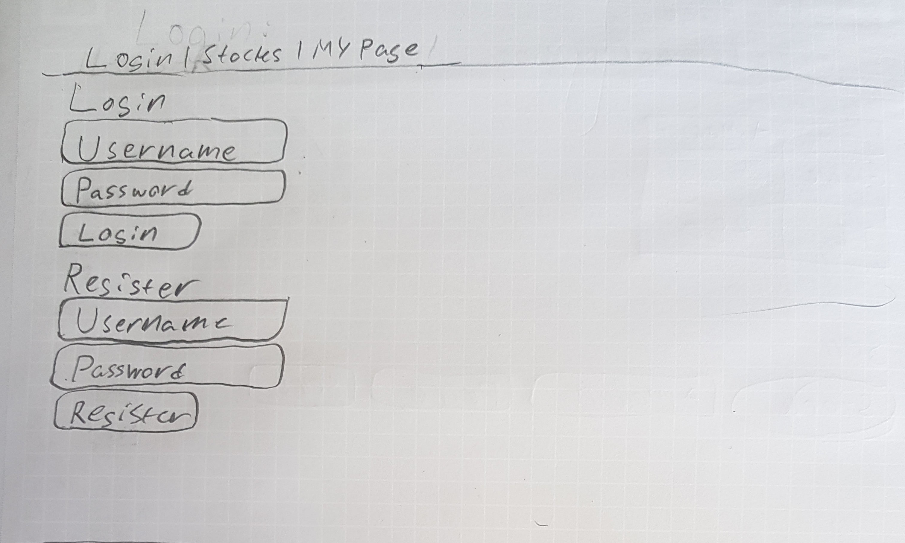
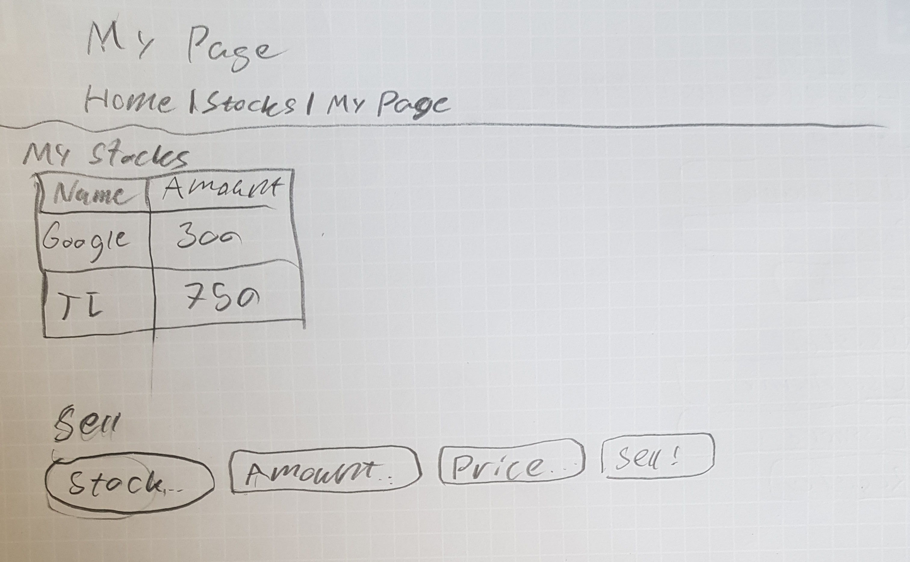
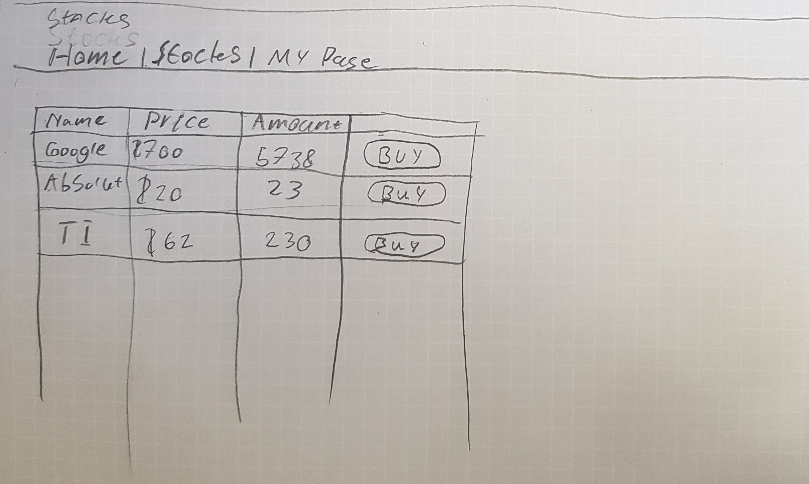
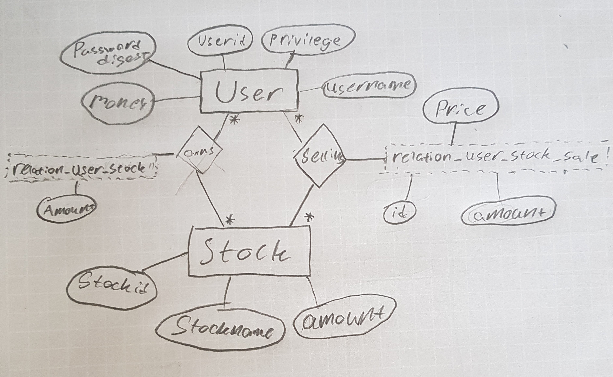

# Projektplan

## 1. Projektbeskrivning (Beskriv vad sidan ska kunna göra)
Sidan ska vara ett sätt för personer att köpa och sälja digitala aktier med "fantasi pengar". Man ska kunna lägga ut aktier för ett visst pris som andra användare sedan kan köpa dem för. Det ska även finnas administratörer som kan skapa pengar och aktier för att hålla marknaden vid liv.
Alla användare ska behöva registrera sig och logga in genom ett inloggnings system som ska använda sig av validering för att skapa extra säkerhet i systemet. Även försäljning ska använda sig av validering så inte användare säljer mer än vad dem har.

## 2. Vyer (visa bildskisser på dina sidor)

### Login sida och landing page
Först har vi inloggnings sidan som man ska använda för att skapa och logga in användare.


### En användares personliga sida
Denna är för att visa vad en användare äger, men också för att låta användaren sätta upp en försäljning.


### Stocks sidan
Detta ska visa vilka aktier som finns och vilket pris dem går för.


## 3. Databas med ER-diagram (Bild)


## 4. Arkitektur (Beskriv filer och mappar - vad gör/innehåller de?)
```
Stocks
├── app.rb : Stora delen av applikationen, innehåller alla routes
├── model.rb : Innehåller all databas funktionalitet
│
├── db : Databasen för projektet
│   └── stonks.db
│
├── doc
│   └── Autogenererad dokumentation av yardoc
│
├── Gemfile
│
├── misc : bilder för dokumentationen
│   ├── login.jpg
│   ├── mypage.jpg
│   ├── relation_table.jpg
│   └── stonks.jpg
│
├── projektplan.md
│
├── public : Alla icke slim filer som ska vara tillgängliga för hemsidan
│   └── css
│       └── style.css
│
├── README.md
│
├── sun.png
│
└── views
    ├── error.slim : Error sida
    ├── index.slim : Första sidan, login sida
    ├── layout.slim : Innehåller header och navigation för alla sidorna
    ├── selling : Allt relaterat till försäljningar
    │   └── show.slim
    ├── stock : Allt relaterat till aktier
    │   ├── edit.slim
    │   ├── index.slim
    │   ├── new.slim
    │   └── show.slim
    └── user : Allt relaterat till användare
        ├── read.slim
        └── show.slim
```
